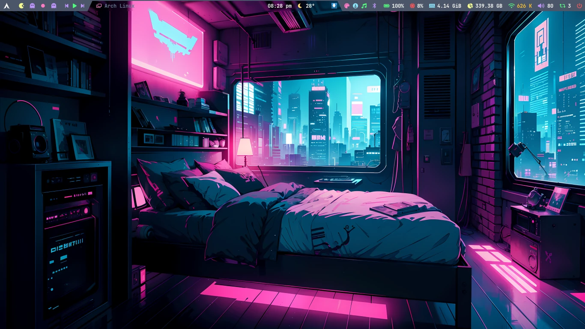
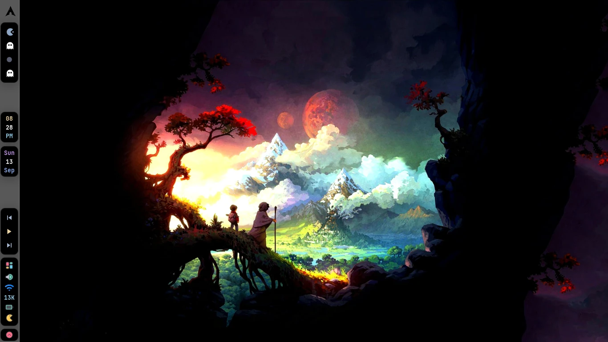
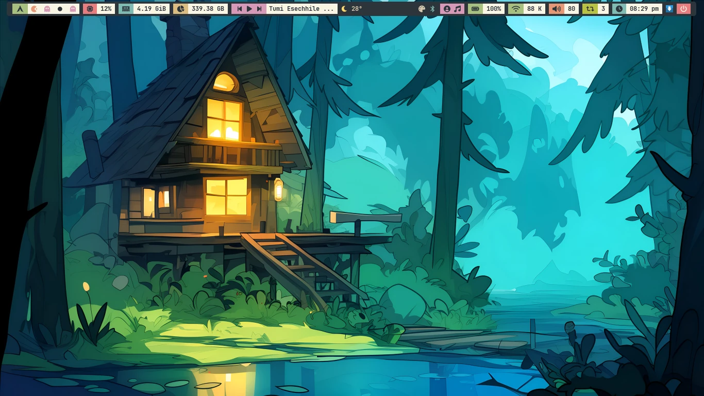
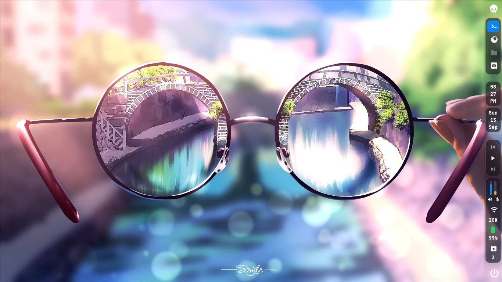
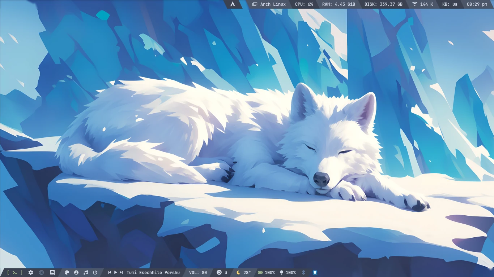
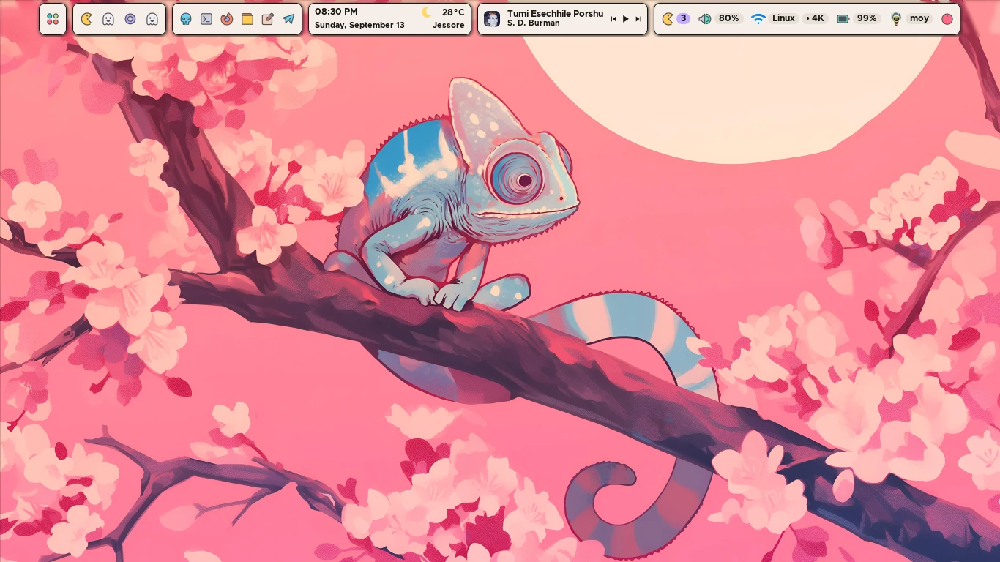
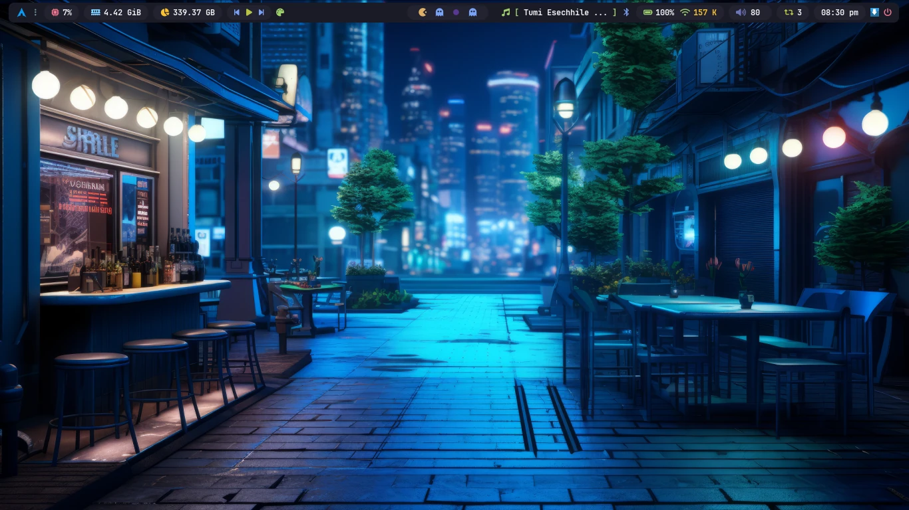
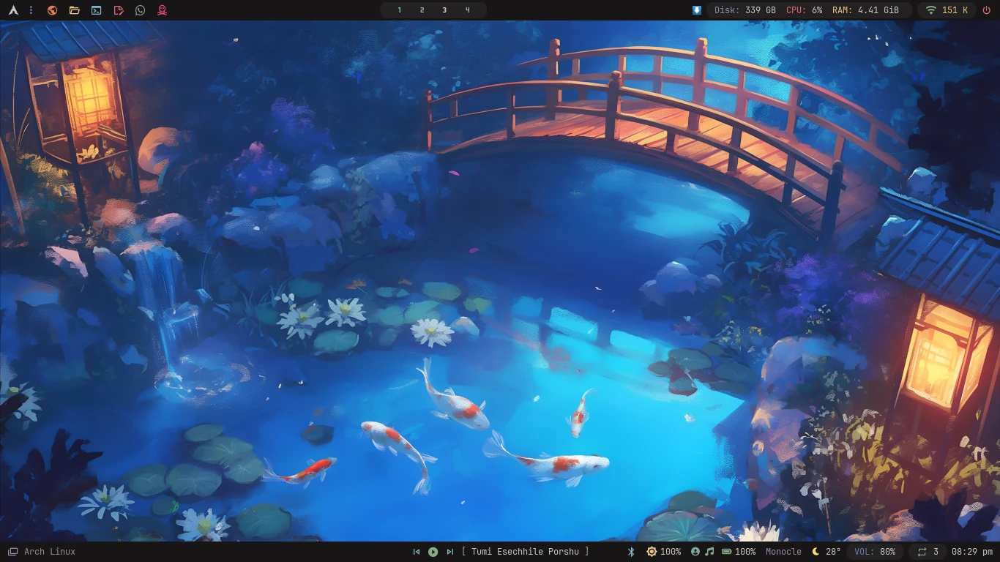

# 🌟 Modernized I3 Desktop Environment

<div align="center">

[](https://archlinux.org/)
[](https://github.com/i3/i3)
[](https://github.com/iMoloy/moy-sddm)
[](LICENSE)

<br>

[**Installation**](#-installation) •
[**Themes Showcase**](#-themes-showcase) •
[**SDDM Login Theme**](#-sddm-login-manager) •
[**Features**](#-features) •
[**Keybindings**](#-keybindings) •
[**Structure**](#-project-structure)

<br>

</div>

---

## 🌟 Overview

Welcome to **i3wmdots** — an aesthetically refined, ultra-fast, and highly modular **i3 Window Manager** desktop environment designed for Arch Linux.

Engineered for daily productivity, coding, and multimedia, this setup combines lightweight performance (<500MB idle RAM) with a state-of-the-art visual experience: 8 handcrafted themes, dynamic on-the-fly rice switching, dual status-bar ecosystems (Polybar & Eww), intelligent wallpaper engines, and the preconfigured **moy-sddm** display manager.

---

## 🎨 Themes Showcase

Switch effortlessly between **8 distinct, fully-synchronized rices** on the fly without closing applications or restarting I3.

| **Dracula** (Polybar) | **Eclipse** (Eww) |
| :---: | :---: |
|  |  |
| *Signature dark theme with neon purple and pink accents* | *Ultra-minimal dark workspace with custom Eww status bar* |

| **Everforest** (Polybar) | **Glass** (Eww) |
| :---: | :---: |
|  |  |
| *Natural, soothing green palette crafted for comfort* | *Modern frosted translucent widgets powered by Eww* |

| **Nord** (Polybar) | **Pastel** (Eww) |
| :---: | :---: |
|  |  |
| *Arctic, north-bluish elegant and clean aesthetic* | *Soft pastel aesthetic with smooth gradients & Eww bar* |

| **TokyoNight** (Polybar) | **Zen** (Polybar) |
| :---: | :---: |
|  |  |
| *Celebrated dark theme inspired by Tokyo city night lights* | *Serene, low-contrast Japanese-inspired aesthetic* |

---

## 🔐 SDDM Login Manager

This setup comes preconfigured with [**moy-sddm**](https://github.com/iMoloy/moy-sddm) as its default display manager theme:

<div align="center">
  <video src="https://raw.githubusercontent.com/iMoloy/moy-sddm/main/previews/preview.mp4" autoplay="autoplay" loop="loop" muted="muted" playsinline="playsinline" width="100%"></video>
</div>

- ✨ **Modern Minimalist UI:** Elegant login screen with responsive layout.
- ⌨️ **Virtual Keyboard:** Seamless `qtvirtualkeyboard` integration.
- 🎬 **Rich Multimedia Support:** Background videos and high-resolution wallpapers.
- 🔄 **Auto Display Manager Config:** Automatically configures `/etc/sddm.conf` and disables legacy display managers during installation.

---

## 🚀 Features

### 🔄 Dynamic On-the-Fly Theme Switching
- Press `Super + x` to open the **RiceSelector** rofi menu with live visual previews.
- Press `Super + r` to launch the comprehensive **RiceEditor GUI** for fine-tuning bar padding, borders, fonts, and animations.
- Themes instantly synchronize color palettes across Kitty, Polybar, Eww, Dunst, GTK, Rofi, and Micro.

### 🖼️ Multi-Engine Wallpaper Support
1. **Default:** Curated theme-specific default wallpaper.
2. **Random:** Random wallpaper picked from the active theme's `walls/` directory.
3. **CustomDir:** Random wallpaper from any user-defined folder.
4. **Animated:** Live video wallpapers (.mp4, .mkv, .gif) powered by `xwinwrap`.
5. **Slideshow:** Automatic periodical wallpaper cycling.

### 📱 Dynamic Rofi Applets Suite
- **Wallpaper Selector:** Grid view of wallpapers with parallel thumbnail caching.
- **Network & Bluetooth:** Full WiFi and Bluetooth device management applets.
- **Clipboard Manager:** Fast clipboard history powered by `clipcat`.
- **Screenshot Utility:** Fullscreen, selected area, and delayed capture via `maim`.
- **Power Menu & Screen Locker:** Fast session controller with `i3lock-color`.

### 🐚 High-Performance Shell & Terminal
- **Kitty Terminal:** JetBrainsMono NF typography, custom slanted powerline tabs, and dynamic rice colors.
- **Modular Zsh:** Pure Zsh environment with `fzf-tab` interactive file previews, syntax highlighting, and auto-suggestions.

---

## ⌨️ Keybindings

| Shortcut | Action |
| :--- | :--- |
| `Super` + `Enter` | Launch Terminal (Kitty) |
| `Super` + `Shift` + `Enter` | Launch Floating Terminal |
| `Super` + `a` | Application Launcher (Rofi) |
| `Super` + `e` | File Manager (Thunar) |
| `Super` + `b` | Web Browser (Brave) |
| `Super` + `c` | Visual Studio Code |
| `Super` + `z` | Antigravity IDE |
| `Super` + `g` | Steam |
| `Super` + `t` | Telegram Desktop |
| `Super` + `d` | Discord |
| `Super` + `w` | Wallpaper Selector |
| `Super` + `s` | System Optimizer (Stacer) |
| `Super` + `m` | Terminal Music Player (ncmpcpp) |
| `Super` + `space` | Fcitx5 Bangla Input Switcher |
| `Super` + `x` | Theme / Rice Selector (Rofi) |
| `Super` + `r` | RiceEditor GUI |
| `Super` + `Ctrl` + `r` | Resize Mode |
| `Super` + `q` | Close Focused Window |
| `Super` + `Shift` + `r` | Restart I3 |
| `Super` + `i` / `Shift` + `i` | Screen Idle Inhibitor Off / On |
| `Alt` + `F1` | Interactive Cheatsheet (Eww) |

> [!TIP]
> For complete keybindings, refer to [`config/i3/config`](config/i3/config) or press `Alt + F1` on your desktop.

---

## 💾 Installation

> [!IMPORTANT]
> The automated installer is built for **Arch Linux** and Arch-based distributions with `systemd`.

### Step-by-Step Setup:

1. **Clone the repository:**
   ```bash
   git clone https://github.com/iMoloy/i3wmdots.git
   cd i3wmdots
   ```

2. **Make `RiceInstaller` executable and run:**
   ```bash
   chmod +x RiceInstaller
   ./RiceInstaller
   ```

3. **What the installer automates:**
   - Installs official packages via `pacman`.
   - Installs AUR packages via `paru` (e.g. `eww-git`, `i3lock-color`, `xwinwrap-0.9-bin`, `fzf-tab-git`, `brave-origin-bin`, `visual-studio-code-bin`, `zapzap-bin`, `stacer-bin`).
   - Backs up any existing configuration safely to `~/.RiceBackup/<timestamp>`.
   - Deploys configurations, scripts, and fonts.
   - Sets up **SDDM** with the [**moy-sddm**](https://github.com/iMoloy/moy-sddm) theme and disables conflicting display managers.
   - Configures user services (`mpd`, `ArchUpdates.timer`).
   - Sets default shell to `zsh`.

4. **Reboot your system:**
   ```bash
   sudo reboot
   ```

---

## 📂 Project Structure

```text
i3wmdots/
├── config/
│   ├── i3/
│   │   ├── bin/               # Helper scripts (RiceSelector, WallSelect, etc.)
│   │   ├── config_dir/        # Core modules, picom, rofi-themes
│   │   ├── eww/               # Eww widgets (cheatsheet, profilecard, welcome)
│   │   ├── rices/             # 8 Handcrafted themes (dracula, glass, etc.)
│   │   └── config             # i3 initialization script and keybindings
│   ├── clipcat/               # Clipboard manager configuration
│   ├── gtk-3.0/               # GTK 3.0 settings
│   ├── kitty/                 # Kitty terminal config
│   ├── mpd/                   # Music Player Daemon config
│   ├── ncmpcpp/               # NCMPCPP music player config
│   └── systemd/               # User systemd service & timer units
├── home/
│   └── .zshrc                 # Modular Zsh configuration
├── misc/
│   ├── applications/          # Desktop entries
│   ├── asciiart/              # ASCII banners
│   ├── bin/                   # Additional CLI scripts (sysfetch, colorscript)
│   └── fonts/                 # Custom font assets
├── RiceInstaller              # Automated installation script
└── README.md
```

---

## 📜 Credits & License

- **Author & Maintainer:** [iMoloy](https://github.com/iMoloy)
- **License:** [GPL-3.0](LICENSE)
